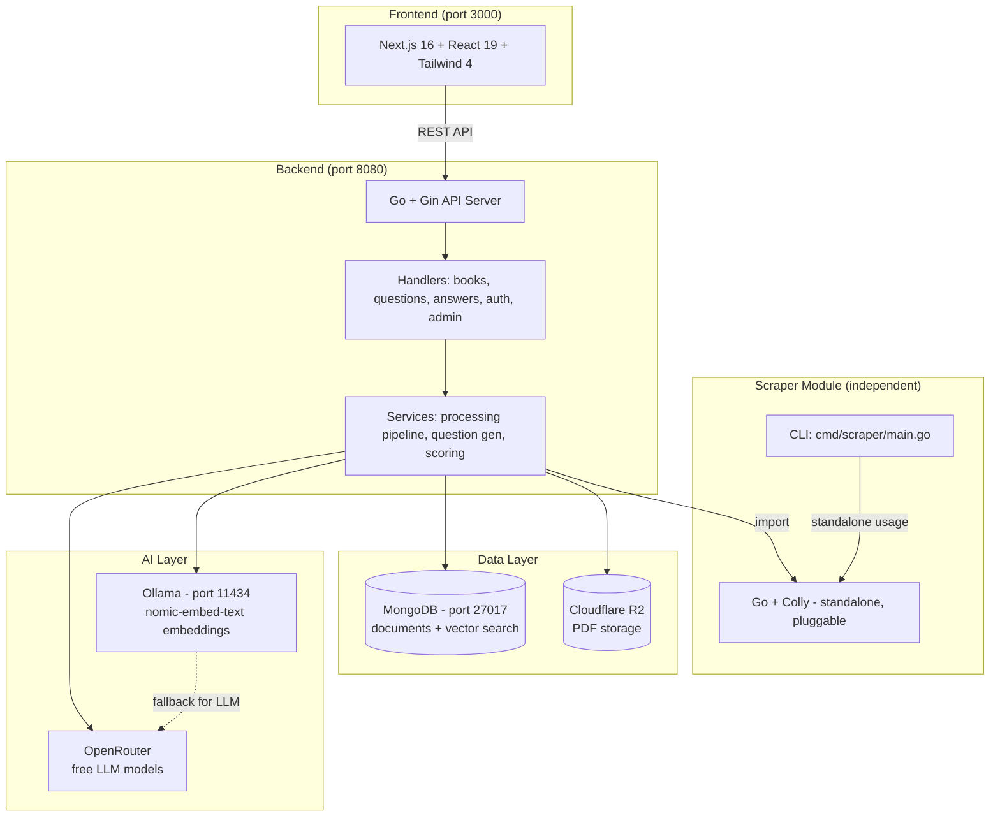
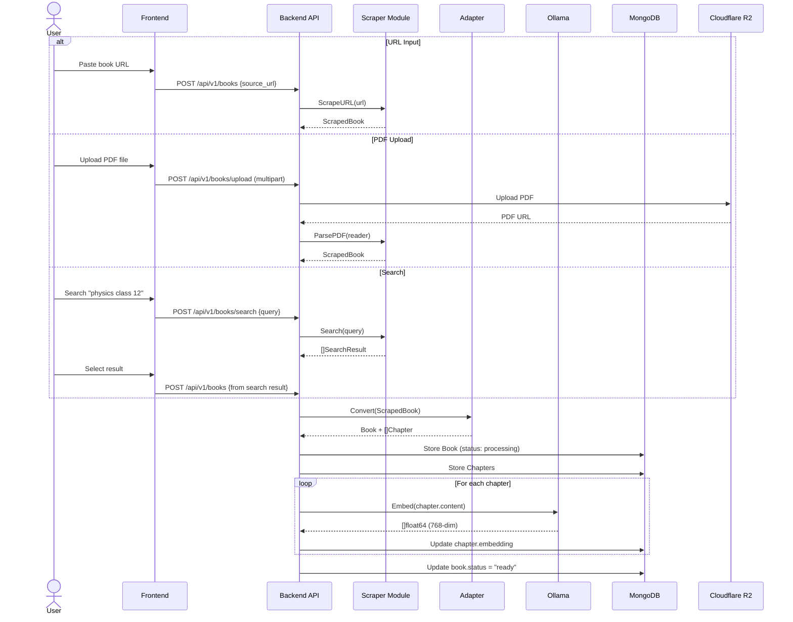
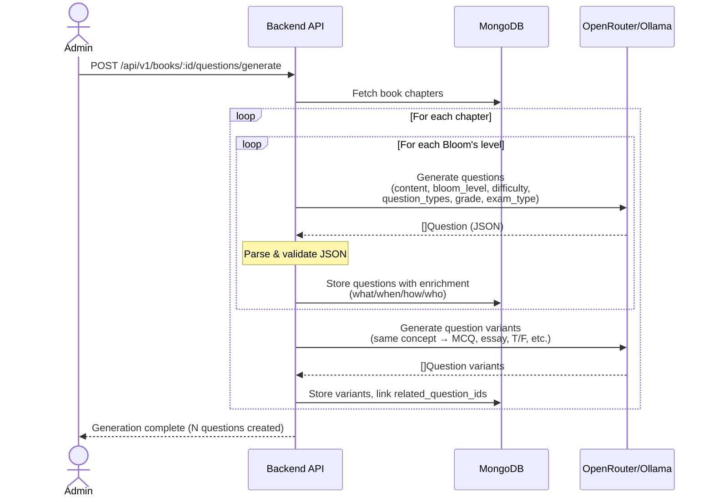
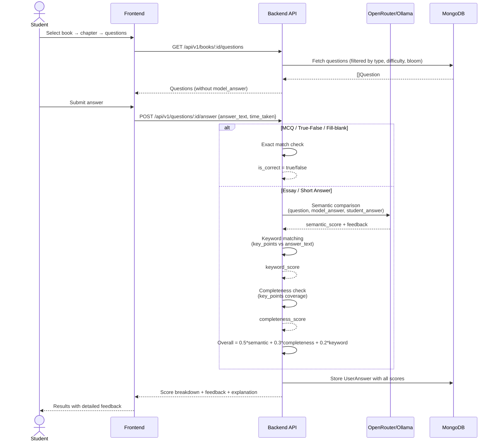
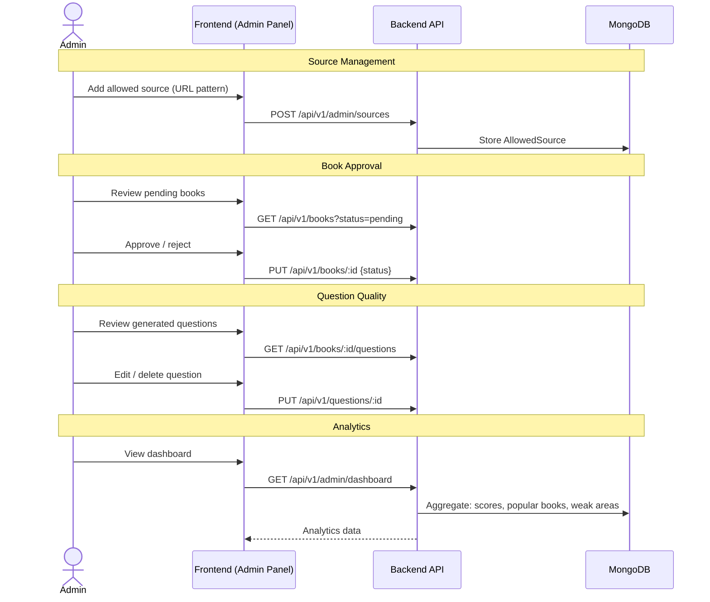

# System Architecture

## Overview

An AI-powered exam preparation platform that extracts book content from multiple sources (URLs, PDFs, search), generates exam-style questions classified by Bloom's Taxonomy, and evaluates student answers through multi-dimensional scoring. The system serves two user roles: students who practice and get scored, and admins who manage content sources and monitor quality.

## Component Diagram



## Monorepo Layout

```
├── go.work                      # Go workspace: backend, scraper, internal
├── docker-compose.yml           # mongo, ollama, backend, frontend
├── Makefile                     # Unified commands
├── CLAUDE.md                    # Project conventions (source of truth)
│
├── scraper/                     # INDEPENDENT module (zero project imports)
│   ├── go.mod                   # Own dependencies only
│   ├── types.go                 # ScrapedBook, Chapter, TOCEntry, Section
│   ├── scraper.go               # Public API
│   ├── fetcher.go               # URL → raw HTML
│   ├── pdf.go                   # PDF → text
│   ├── extractor.go             # HTML → structured data
│   ├── toc.go                   # Table of contents extraction
│   ├── search.go                # Open Library + Google Books
│   └── cmd/scraper/main.go     # Standalone CLI
│
├── internal/                    # Project-specific shared code
│   ├── models/                  # All data entities
│   ├── db/                      # MongoDB connection + queries
│   ├── adapter/                 # scraper output → app models
│   ├── llm/                     # OpenRouter + Ollama client
│   ├── embeddings/              # Embedding generation
│   ├── scoring/                 # Answer evaluation
│   └── storage/                 # Cloudflare R2 client
│
├── backend/                     # API server
│   ├── handlers/                # HTTP endpoints
│   ├── services/                # Business logic
│   ├── middleware/              # Auth, CORS, rate limiting
│   └── main.go
│
├── frontend/                    # Next.js app
│   └── src/
│       ├── app/                 # Pages (App Router)
│       ├── components/          # UI components
│       └── lib/                 # API client, types
│
└── docs/                        # This documentation
```

## Data Flow Diagrams

### 1. Book Input Flow



### 2. Question Generation Flow



### 3. Student Answer Flow



### 4. Admin Management Flow



## Service Architecture

| Service | Image | Port | Purpose | Dependencies |
|---|---|---|---|---|
| **mongo** | `mongo:7` | 27017 | Document storage + vector search | None |
| **ollama** | `ollama/ollama` | 11434 | Embedding generation (nomic-embed-text) | None |
| **backend** | Custom (Go build) | 8080 | REST API server | mongo, ollama |
| **frontend** | Custom (Next.js build) | 3000 | Web UI | backend |

External services (not in Docker):
- **OpenRouter** — Cloud LLM API (free tier), primary provider for question generation and scoring
- **Cloudflare R2** — PDF file storage (S3-compatible, 10GB free)

## Architectural Decision Records

### ADR-1: MongoDB over Postgres

**Context**: Need a database for book documents, chapters with embedded vectors, questions with variable structures (MCQ has options, essay has model_answer, etc.), and flexible metadata.

**Decision**: Use MongoDB 7 with Atlas free tier (M0) for production vector search, local mongo:7 for development.

**Consequences**:
- Book/chapter/question data maps naturally to documents
- Questions with different structures (MCQ vs essay) stored in same collection without schema gymnastics
- MongoDB Atlas Vector Search provides native `$vectorSearch` for semantic search
- Trade-off: no joins — denormalize or do application-level lookups
- Trade-off: no ACID transactions across collections (acceptable for this use case)

### ADR-2: OpenRouter + Ollama Dual LLM Strategy

**Context**: Need LLM for question generation and answer scoring. Must be free and open-source. User has no GPU.

**Decision**: OpenRouter as primary (free tier, cloud-hosted open models), Ollama as local fallback.

**Consequences**:
- OpenRouter gives access to powerful models (Llama 3.1 70B) without local hardware
- Free tier has rate limits — batch processing needs throttling
- Ollama fallback ensures the system works offline (with smaller models on CPU)
- Code uses a provider-agnostic `LLMClient` interface — swappable
- Trade-off: cloud dependency for primary LLM (mitigated by fallback)

### ADR-3: Ollama nomic-embed-text for Embeddings

**Context**: Need embedding generation for vector search. Must work without GPU.

**Decision**: Use Ollama running `nomic-embed-text` (768-dim, Apache 2.0) for all embeddings.

**Consequences**:
- Runs comfortably on CPU (~300MB model)
- No rate limits, no network dependency
- 768 dimensions is a good balance of quality vs storage
- Trade-off: must run Ollama even if using OpenRouter for LLM

### ADR-4: Cloudflare R2 for File Storage

**Context**: Users upload PDFs. Need to store them outside the server filesystem for statelessness.

**Decision**: Cloudflare R2 (S3-compatible, 10GB free, zero egress fees).

**Consequences**:
- Server remains stateless — can scale horizontally
- S3-compatible API means standard AWS SDK works
- 10GB free covers thousands of book PDFs
- Trade-off: external dependency, but graceful degradation possible

### ADR-5: Scraper as Independent Module

**Context**: The scraper extracts content from URLs and PDFs. It should be reusable in other projects.

**Decision**: The `scraper/` module has zero imports from `internal/` or `backend/`. It defines its own types and returns generic structs. The project uses an `internal/adapter/` to convert scraper output to app models.

**Consequences**:
- Scraper can be extracted to its own repository and published as a Go library
- Clean separation of concerns — scraper knows nothing about questions, scoring, or MongoDB
- Adapter pattern adds a thin conversion layer
- Trade-off: slight duplication (scraper.Chapter vs models.Chapter) — worth it for independence

### ADR-6: Go Workspace (go.work)

**Context**: Monorepo with three Go modules (backend, scraper, internal) that need to import each other locally.

**Decision**: Use `go.work` to link modules without publishing to a module proxy.

**Consequences**:
- Local development works seamlessly — modules import each other directly
- No need to publish modules or use replace directives
- Docker builds need the full workspace context (root as build context)
- Trade-off: `go.work` is not committed to module proxies — only works for local development

### ADR-7: Bloom's Taxonomy for Question Classification

**Context**: Questions need to be classified by cognitive level to help students target their weak areas.

**Decision**: Tag every question with one of six Bloom's Taxonomy levels: Remember, Understand, Apply, Analyze, Evaluate, Create.

**Consequences**:
- Industry standard in education — instantly recognizable
- Enables powerful analytics: "You're strong at Remember but weak at Analyze"
- LLM prompts include level descriptions for accurate generation
- Students can filter practice by cognitive level
- Trade-off: LLM classification may not always be accurate — admin can override

### ADR-8: Three-Dimension Answer Scoring

**Context**: Essay and short-answer questions need nuanced scoring, not just "right/wrong."

**Decision**: Score on three dimensions — Semantic (50%), Completeness (30%), Keyword (20%) — combining LLM-based and algorithmic evaluation.

**Consequences**:
- More actionable feedback than a single score
- Students see exactly what they missed (key points, terminology)
- Semantic scoring catches correct answers with different wording
- Keyword scoring ensures domain-specific terminology is used
- Trade-off: LLM scoring adds latency (~1-3s per answer)
