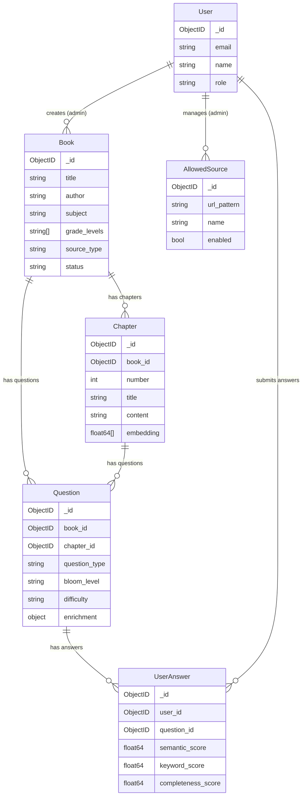

# Data Models

## Entity Relationship Diagram



## Book

**Collection**: `books`

| Field | BSON Type | Required | Description | Example |
|---|---|---|---|---|
| `_id` | ObjectID | auto | Primary key | |
| `title` | string | yes | Book title | "Physics Class 12 NCERT" |
| `author` | string | yes | Author name(s) | "H.C. Verma" |
| `isbn` | string | no | ISBN-10 or ISBN-13 | "978-0-07-070644-4" |
| `publisher` | string | no | Publisher name | "NCERT" |
| `language` | string | no | Language code, default "en" | "en" |
| `subject` | string | yes | Primary subject | "Physics" |
| `grade_levels` | string[] | yes | Target grades/levels | ["Grade 12", "Undergraduate"] |
| `education_system` | string | no | Education system | "CBSE", "US Common Core" |
| `source_type` | string (enum) | yes | How the book entered the system | "pdf", "url", "search" |
| `source_url` | string | no | URL where book was found | "https://example.com/book" |
| `pdf_url` | string | no | Cloudflare R2 URL (if uploaded) | "https://r2.../book.pdf" |
| `cover_image_url` | string | no | Cover image URL | |
| `status` | string (enum) | yes | Processing status, default "pending" | "pending", "processing", "ready", "failed" |
| `processing_error` | string | no | Error message if status is "failed" | "PDF parsing failed: corrupted file" |
| `toc` | TOCEntry[] | no | Table of contents (embedded) | See below |
| `metadata` | object | no | Flexible key-value for extra data | {"pages": 350, "edition": "3rd"} |
| `created_by` | ObjectID | no | Ref to User who added it | |
| `created_at` | datetime | yes | Creation timestamp | |
| `updated_at` | datetime | yes | Last update timestamp | |

**TOCEntry (embedded in Book.toc)**:

| Field | Type | Description |
|---|---|---|
| `number` | int | Chapter/section number |
| `title` | string | Chapter/section title |
| `page` | int | Page number (0 if unknown) |
| `depth` | int | Nesting level (0 = top level) |

**Indexes**:
```javascript
db.books.createIndex({ isbn: 1 }, { unique: true, sparse: true })
db.books.createIndex({ title: "text", author: "text", subject: "text" })
db.books.createIndex({ status: 1, created_at: -1 })
db.books.createIndex({ subject: 1, grade_levels: 1 })
db.books.createIndex({ created_by: 1 })
```

## Chapter

**Collection**: `chapters`

| Field | BSON Type | Required | Description | Example |
|---|---|---|---|---|
| `_id` | ObjectID | auto | Primary key | |
| `book_id` | ObjectID | yes | Ref to Book | |
| `number` | int | yes | Chapter order (1-based) | 5 |
| `title` | string | yes | Chapter title | "Laws of Motion" |
| `content` | string | yes | Full text content | "Newton's first law states..." |
| `summary` | string | no | LLM-generated summary | |
| `topics` | string[] | no | Extracted topic tags | ["Newton's laws", "friction", "momentum"] |
| `embedding` | double[] | no | 768-dim vector (nomic-embed-text) | [0.023, -0.156, ...] |
| `word_count` | int | no | Word count of content | 4500 |
| `created_at` | datetime | yes | Creation timestamp | |

**Indexes**:
```javascript
db.chapters.createIndex({ book_id: 1, number: 1 }, { unique: true })
db.chapters.createIndex({ book_id: 1 })
```

**Vector Search Index** (MongoDB Atlas):
```json
{
  "name": "chapter_vector_index",
  "type": "vectorSearch",
  "definition": {
    "fields": [
      {
        "type": "vector",
        "path": "embedding",
        "numDimensions": 768,
        "similarity": "cosine"
      },
      {
        "type": "filter",
        "path": "book_id"
      }
    ]
  }
}
```

## Question

**Collection**: `questions`

| Field | BSON Type | Required | Description | Example |
|---|---|---|---|---|
| `_id` | ObjectID | auto | Primary key | |
| `book_id` | ObjectID | yes | Ref to Book | |
| `chapter_id` | ObjectID | yes | Ref to Chapter | |
| `topic` | string | yes | Specific topic tested | "Newton's Third Law" |
| `question_text` | string | yes | The question itself | "Explain Newton's third law with an example" |
| `question_type` | string (enum) | yes | Question format | See enum below |
| `difficulty` | string (enum) | yes | Difficulty level | "easy", "medium", "hard" |
| `bloom_level` | string (enum) | yes | Bloom's Taxonomy level | See enum below |
| `grade_level` | string | yes | Target grade | "Grade 12" |
| `exam_type` | string | no | Target exam | "CBSE Board", "JEE", "NEET" |
| `options` | Option[] | no | MCQ options (embedded) | See below |
| `correct_answer` | string | no | For MCQ/T-F/fill_blank | "B" or "True" or "momentum" |
| `model_answer` | string | no | Ideal answer for essay/short | "Newton's third law states..." |
| `key_points` | string[] | no | Key concepts expected in answer | ["action-reaction", "equal and opposite"] |
| `explanation` | string | no | Why this is correct | "This is because every force..." |
| `enrichment` | Enrichment | no | Learning context (embedded) | See below |
| `related_question_ids` | ObjectID[] | no | Same concept, different format | |
| `tags` | string[] | no | Searchable tags | ["mechanics", "forces"] |
| `created_at` | datetime | yes | Creation timestamp | |

**Question Type Enum**: `mcq`, `essay`, `fill_blank`, `true_false`, `short_answer`, `match`, `assertion_reasoning`

**Bloom's Level Enum**: `remember`, `understand`, `apply`, `analyze`, `evaluate`, `create`

**Difficulty Enum**: `easy`, `medium`, `hard`

**Option (embedded in Question.options, for MCQ)**:

| Field | Type | Description |
|---|---|---|
| `text` | string | Option text |
| `is_correct` | bool | Whether this is the correct option |

**Enrichment (embedded in Question.enrichment)**:

| Field | Type | Description | Example |
|---|---|---|---|
| `what` | string | What concept/skill is being tested | "Understanding of action-reaction pairs" |
| `when` | string | When is this relevant | "Board exams, competitive physics exams, real-world engineering" |
| `how` | string | How to approach this question | "Identify the two interacting objects first, then describe forces" |
| `who` | string | Target audience | "Grade 11-12 Physics students, JEE aspirants" |

**Indexes**:
```javascript
db.questions.createIndex({ book_id: 1, chapter_id: 1 })
db.questions.createIndex({ question_type: 1, difficulty: 1, bloom_level: 1 })
db.questions.createIndex({ book_id: 1, bloom_level: 1, difficulty: 1 })
db.questions.createIndex({ question_text: "text", topic: "text" })
db.questions.createIndex({ tags: 1 })
```

## UserAnswer

**Collection**: `user_answers`

| Field | BSON Type | Required | Description | Example |
|---|---|---|---|---|
| `_id` | ObjectID | auto | Primary key | |
| `user_id` | ObjectID | yes | Ref to User | |
| `question_id` | ObjectID | yes | Ref to Question | |
| `answer_text` | string | yes | Student's answer | "Newton's third law means..." |
| `is_correct` | bool | no | For MCQ/T-F/fill_blank | true |
| `semantic_score` | double | no | LLM meaning comparison (0-100) | 78.5 |
| `keyword_score` | double | no | Key term matching (0-100) | 65.0 |
| `completeness_score` | double | no | Key point coverage (0-100) | 80.0 |
| `overall_score` | double | no | Weighted combination (0-100) | 75.5 |
| `feedback` | string | no | AI-generated feedback | "Good explanation but missed..." |
| `time_taken` | int | no | Seconds spent on question | 120 |
| `created_at` | datetime | yes | Submission timestamp | |

**Indexes**:
```javascript
db.user_answers.createIndex({ user_id: 1, created_at: -1 })
db.user_answers.createIndex({ user_id: 1, question_id: 1 })
db.user_answers.createIndex({ question_id: 1 })
```

## User

**Collection**: `users`

| Field | BSON Type | Required | Description | Example |
|---|---|---|---|---|
| `_id` | ObjectID | auto | Primary key | |
| `email` | string | yes | Email (unique) | "student@example.com" |
| `name` | string | yes | Display name | "Kaushal" |
| `password_hash` | string | yes | Bcrypt hash | |
| `role` | string (enum) | yes | User role, default "student" | "student", "admin" |
| `grade_level` | string | no | Current grade/level | "Grade 12" |
| `education_system` | string | no | Education system | "CBSE" |
| `exam_preparing_for` | string | no | Target exam | "JEE Mains" |
| `avatar_url` | string | no | Profile picture URL | |
| `created_at` | datetime | yes | Registration timestamp | |
| `updated_at` | datetime | yes | Last update timestamp | |

**Indexes**:
```javascript
db.users.createIndex({ email: 1 }, { unique: true })
```

## AllowedSource

**Collection**: `allowed_sources`

| Field | BSON Type | Required | Description | Example |
|---|---|---|---|---|
| `_id` | ObjectID | auto | Primary key | |
| `url_pattern` | string | yes | URL regex or domain | "*.gutenberg.org/*" |
| `name` | string | yes | Human-readable name | "Project Gutenberg" |
| `source_type` | string (enum) | yes | How to access | "scrape", "api" |
| `enabled` | bool | yes | Is this source active? Default true | true |
| `added_by` | ObjectID | no | Ref to admin User | |
| `notes` | string | no | Admin notes | "Public domain books, no rate limit" |
| `created_at` | datetime | yes | Creation timestamp | |
| `updated_at` | datetime | yes | Last update timestamp | |

**Indexes**:
```javascript
db.allowed_sources.createIndex({ enabled: 1 })
db.allowed_sources.createIndex({ url_pattern: 1 }, { unique: true })
```

## Scraper Types vs App Types

The scraper module has its own types in `scraper/types.go`. The adapter in `internal/adapter/` converts them to app models.

| Scraper Type | Scraper Field | App Model | App Field | Notes |
|---|---|---|---|---|
| `ScrapedBook` | `.Title` | `Book` | `.title` | Direct mapping |
| `ScrapedBook` | `.Author` | `Book` | `.author` | Direct mapping |
| `ScrapedBook` | `.ISBN` | `Book` | `.isbn` | Direct mapping |
| `ScrapedBook` | `.Publisher` | `Book` | `.publisher` | Direct mapping |
| `ScrapedBook` | `.Language` | `Book` | `.language` | Direct mapping |
| `ScrapedBook` | `.Subject` | `Book` | `.subject` | Direct mapping |
| `ScrapedBook` | `.Description` | `Book` | `.metadata["description"]` | Stored in flexible metadata |
| `ScrapedBook` | `.CoverURL` | `Book` | `.cover_image_url` | Direct mapping |
| `ScrapedBook` | `.SourceURL` | `Book` | `.source_url` | Direct mapping |
| `ScrapedBook` | `.SourceType` | `Book` | `.source_type` | Direct mapping |
| `ScrapedBook` | `.TOC` | `Book` | `.toc` | `[]TOCEntry` → embedded array |
| `ScrapedBook` | `.Chapters` | `Chapter` | (separate docs) | Each becomes a Chapter document |
| `ScrapedBook` | `.RawMetadata` | `Book` | `.metadata` | Merged into metadata object |
| `scraper.Chapter` | `.Number` | `Chapter` | `.number` | Direct mapping |
| `scraper.Chapter` | `.Title` | `Chapter` | `.title` | Direct mapping |
| `scraper.Chapter` | `.Content` | `Chapter` | `.content` | Direct mapping |
| `scraper.Chapter` | `.Sections` | `Chapter` | `.content` | Sections concatenated into content |
| `scraper.TOCEntry` | `.Number` | `Book.toc[]` | `.number` | Direct mapping |
| `scraper.TOCEntry` | `.Title` | `Book.toc[]` | `.title` | Direct mapping |
| `scraper.TOCEntry` | `.Page` | `Book.toc[]` | `.page` | Direct mapping |
| `scraper.TOCEntry` | `.Depth` | `Book.toc[]` | `.depth` | Direct mapping |

Fields NOT from scraper (set by the app):
- `Book.status` — set to "pending" by adapter, updated by pipeline
- `Book.grade_levels` — set by user or admin
- `Book.education_system` — set by user or admin
- `Book.created_by` — set from auth context
- `Chapter.embedding` — generated by embedding service
- `Chapter.summary` — generated by LLM
- `Chapter.topics` — extracted by LLM
