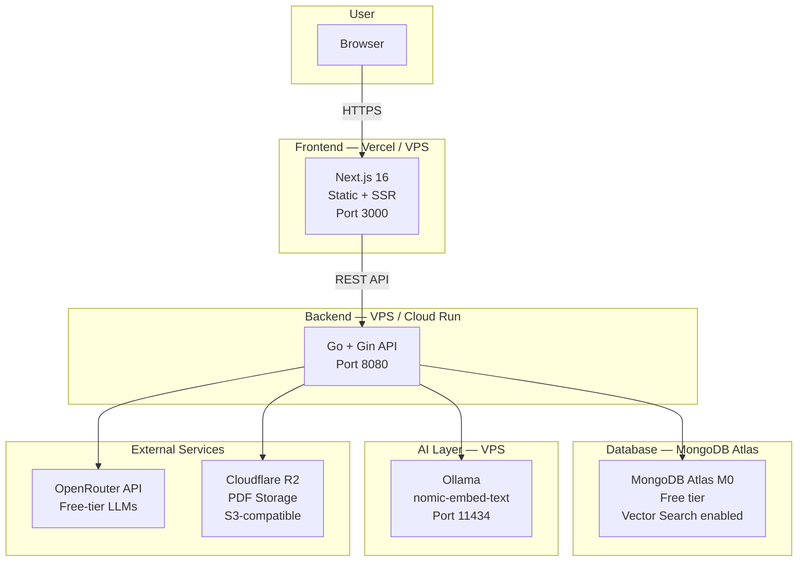

# Production Deployment

## Architecture Overview



In production, MongoDB moves to Atlas (managed), Ollama runs alongside the backend on a VPS, and the frontend can be deployed to Vercel or served from the same VPS. OpenRouter and Cloudflare R2 are external services accessed over HTTPS.

---

## Backend Dockerfile (Multi-Stage Go Build)

The backend imports from `internal/` and `scraper/` via the Go workspace (`go.work`). This means the Docker build context must be the **project root**, not `./backend` alone.

Create `backend/Dockerfile`:

```dockerfile
# ---- Stage 1: Build ----
FROM golang:1.25-alpine AS builder

WORKDIR /workspace

# Copy the Go workspace file and all module definitions first (for layer caching)
COPY go.work go.work.sum ./
COPY backend/go.mod backend/go.sum ./backend/
COPY scraper/go.mod scraper/go.sum ./scraper/
COPY internal/go.mod internal/go.sum ./internal/

# Download dependencies for all modules
RUN cd backend && go mod download
RUN cd scraper && go mod download
RUN cd internal && go mod download

# Copy all source code
COPY backend/ ./backend/
COPY scraper/ ./scraper/
COPY internal/ ./internal/

# Build the backend binary
# The go.work file tells the Go toolchain where to find local modules
RUN cd backend && CGO_ENABLED=0 GOOS=linux go build -o /app/server main.go

# ---- Stage 2: Runtime ----
FROM alpine:3.21

RUN apk --no-cache add ca-certificates tzdata

WORKDIR /app

COPY --from=builder /app/server .

EXPOSE 8080

CMD ["./server"]
```

Key points:
- The build context in `docker-compose.yml` is set to `.` (the project root), and `dockerfile` points to `backend/Dockerfile`. This gives the build stage access to `internal/`, `scraper/`, and `go.work`.
- `go.work` is copied into the build so the Go toolchain resolves local module references.
- `CGO_ENABLED=0` produces a static binary that runs on `alpine` without glibc.
- Dependencies are downloaded before copying source code so that the layer is cached across rebuilds.

---

## Frontend Dockerfile (Multi-Stage Next.js)

Create `frontend/Dockerfile`:

```dockerfile
# ---- Stage 1: Dependencies ----
FROM node:22-alpine AS deps

WORKDIR /app

COPY package.json package-lock.json* ./
RUN npm ci --prefer-offline

# ---- Stage 2: Build ----
FROM node:22-alpine AS builder

WORKDIR /app

COPY --from=deps /app/node_modules ./node_modules
COPY . .

# Set the backend API URL for the build
ARG NEXT_PUBLIC_API_URL=http://localhost:8080
ENV NEXT_PUBLIC_API_URL=$NEXT_PUBLIC_API_URL

RUN npm run build

# ---- Stage 3: Runtime ----
FROM node:22-alpine AS runner

WORKDIR /app

ENV NODE_ENV=production

# Create a non-root user
RUN addgroup --system --gid 1001 nodejs && \
    adduser --system --uid 1001 nextjs

# Copy the standalone output
COPY --from=builder /app/public ./public
COPY --from=builder --chown=nextjs:nodejs /app/.next/standalone ./
COPY --from=builder --chown=nextjs:nodejs /app/.next/static ./.next/static

USER nextjs

EXPOSE 3000

ENV PORT=3000
ENV HOSTNAME="0.0.0.0"

CMD ["node", "server.js"]
```

For the standalone output to work, add this to `frontend/next.config.ts`:

```typescript
import type { NextConfig } from "next";

const nextConfig: NextConfig = {
  output: "standalone",
};

export default nextConfig;
```

Key points:
- The frontend build context is `./frontend` (self-contained, no workspace dependencies).
- The `standalone` output mode produces a minimal Node.js server (~15 MB) instead of shipping all of `node_modules`.
- `NEXT_PUBLIC_API_URL` is baked in at build time. Pass it as a build arg to point the frontend at the production backend.
- The runtime stage runs as a non-root user for security.

---

## MongoDB Atlas M0 Setup

Atlas M0 is the free-tier managed MongoDB cluster. It provides 512 MB of storage, shared RAM, and built-in vector search -- sufficient for development and small-scale production.

### 1. Create an Atlas account

Go to [cloud.mongodb.com](https://cloud.mongodb.com/) and sign up.

### 2. Create a free cluster

- Click "Build a Database."
- Select **M0 Free Tier**.
- Choose a cloud provider and region close to your backend server (e.g., AWS us-east-1).
- Name the cluster (e.g., `BookScrapingCluster`).

### 3. Configure network access

- Go to Security > Network Access.
- Add your backend server's IP address (or `0.0.0.0/0` for testing -- restrict this in production).

### 4. Create a database user

- Go to Security > Database Access.
- Create a user with read/write permissions on the `book_db` database.
- Use a strong password. Store it securely.

### 5. Get the connection string

- Click "Connect" on your cluster.
- Select "Connect your application" > "Go" driver.
- Copy the connection string. It looks like:
  ```
  mongodb+srv://<username>:<password>@clustername.xxxxx.mongodb.net/?retryWrites=true&w=majority&appName=BookScrapingAndQuestion
  ```
- Set this as `MONGODB_URL` in your production `.env`.

### 6. Create the vector search index

Vector search is required for semantic chapter search. In the Atlas UI:

1. Go to your cluster > Browse Collections > `book_db` > `chapters`.
2. Click the "Search Indexes" tab.
3. Click "Create Search Index" > "JSON Editor."
4. Paste the following definition:

```json
{
  "name": "chapter_vector_index",
  "type": "vectorSearch",
  "definition": {
    "fields": [
      {
        "type": "vector",
        "path": "embedding",
        "numDimensions": 768,
        "similarity": "cosine"
      },
      {
        "type": "filter",
        "path": "book_id"
      }
    ]
  }
}
```

5. Click "Create." The index builds in a few minutes.

### 7. Create standard indexes

Connect with `mongosh` and run the index creation commands from `docs/data-models.md`:

```javascript
use book_db

db.books.createIndex({ isbn: 1 }, { unique: true, sparse: true })
db.books.createIndex({ title: "text", author: "text", subject: "text" })
db.books.createIndex({ status: 1, created_at: -1 })
db.books.createIndex({ subject: 1, grade_levels: 1 })
db.books.createIndex({ created_by: 1 })

db.chapters.createIndex({ book_id: 1, number: 1 }, { unique: true })
db.chapters.createIndex({ book_id: 1 })

db.questions.createIndex({ book_id: 1, chapter_id: 1 })
db.questions.createIndex({ question_type: 1, difficulty: 1, bloom_level: 1 })
db.questions.createIndex({ book_id: 1, bloom_level: 1, difficulty: 1 })
db.questions.createIndex({ question_text: "text", topic: "text" })
db.questions.createIndex({ tags: 1 })

db.user_answers.createIndex({ user_id: 1, created_at: -1 })
db.user_answers.createIndex({ user_id: 1, question_id: 1 })
db.user_answers.createIndex({ question_id: 1 })

db.users.createIndex({ email: 1 }, { unique: true })

db.allowed_sources.createIndex({ enabled: 1 })
db.allowed_sources.createIndex({ url_pattern: 1 }, { unique: true })
```

---

## Cloudflare R2 Setup

Cloudflare R2 provides S3-compatible object storage with 10 GB free and zero egress fees. It stores user-uploaded PDFs.

### 1. Create a Cloudflare account

Go to [dash.cloudflare.com](https://dash.cloudflare.com/) and sign up.

### 2. Enable R2

- In the Cloudflare dashboard, go to R2 Object Storage.
- You may need to add a payment method (you will not be charged within the free tier: 10 GB storage, 10 million Class B requests/month).

### 3. Create a bucket

- Click "Create bucket."
- Name: `book-pdfs` (or whatever you set in `CLOUDFLARE_R2_BUCKET_NAME`).
- Location hint: choose a region near your backend server.

### 4. Create an API token

- Go to R2 > Manage R2 API Tokens.
- Click "Create API token."
- Permissions: Object Read & Write.
- Specify the bucket: `book-pdfs`.
- Copy the **Access Key ID** and **Secret Access Key**. These are shown only once.

### 5. Get your Account ID

- Your Account ID is in the URL of the Cloudflare dashboard: `dash.cloudflare.com/<account-id>/...`
- Or find it in the R2 overview page.

### 6. Set environment variables

```
CLOUDFLARE_R2_ACCOUNT_ID=your-account-id
CLOUDFLARE_R2_ACCESS_KEY_ID=your-access-key-id
CLOUDFLARE_R2_SECRET_ACCESS_KEY=your-secret-access-key
CLOUDFLARE_R2_BUCKET_NAME=book-pdfs
```

The backend uses the AWS SDK for Go with a custom endpoint to interact with R2:

```
Endpoint: https://<account-id>.r2.cloudflarestorage.com
```

---

## Ollama in Production

Ollama runs the `nomic-embed-text` model for generating 768-dimensional embeddings. It must be accessible to the backend in production.

### Option A: Ollama on the same VPS as the backend

This is the simplest approach. Run Ollama as a Docker container or install it directly.

**Docker (recommended):**

```yaml
# In docker-compose.prod.yml or your deployment config
ollama:
  image: ollama/ollama:latest
  restart: unless-stopped
  ports:
    - "127.0.0.1:11434:11434"   # Bind to localhost only, not public
  volumes:
    - ollama_data:/root/.ollama
```

After starting, pull the model:

```bash
docker exec <ollama-container> ollama pull nomic-embed-text
```

Set `OLLAMA_URL=http://ollama:11434` (Docker network) or `OLLAMA_URL=http://127.0.0.1:11434` (host).

**Resource requirements:**
- `nomic-embed-text` uses ~300 MB of RAM.
- CPU-only -- no GPU needed.
- Embedding a chapter takes ~1-3 seconds on a 2-core VPS.

### Option B: Ollama on a separate machine

If your backend machine is resource-constrained, run Ollama on a different server:

- Install Ollama on the second machine.
- Set `OLLAMA_HOST=0.0.0.0:11434` in Ollama's environment so it listens on all interfaces.
- Secure the connection (firewall rules, VPN, or reverse proxy with auth).
- Set `OLLAMA_URL=http://<ollama-machine-ip>:11434` in the backend environment.

### Model persistence

Ensure the Ollama data volume is persisted. If the container restarts without a volume, you must re-pull the model. The `ollama_data` Docker volume in `docker-compose.yml` handles this.

---

## Environment Variables: Development vs Production

| Variable | Development | Production |
|---|---|---|
| `MONGODB_URL` | `mongodb://localhost:27017` | `mongodb+srv://<user>:<pass>@cluster.xxxxx.mongodb.net/?retryWrites=true&w=majority` |
| `MONGODB_DB` | `book_db` | `book_db` (same name, different cluster) |
| `OLLAMA_URL` | `http://localhost:11434` | `http://ollama:11434` or `http://127.0.0.1:11434` |
| `OPENROUTER_API_KEY` | `sk-or-...` (free tier) | `sk-or-...` (same key, or a separate production key with higher limits) |
| `CLOUDFLARE_R2_ACCOUNT_ID` | (optional, can skip) | `your-account-id` |
| `CLOUDFLARE_R2_ACCESS_KEY_ID` | (optional) | `your-access-key-id` |
| `CLOUDFLARE_R2_SECRET_ACCESS_KEY` | (optional) | `your-secret-access-key` |
| `CLOUDFLARE_R2_BUCKET_NAME` | `book-pdfs` | `book-pdfs` |
| `GIN_MODE` | `debug` (default) | `release` |
| `PORT` | `8080` (default) | `8080` (or behind a reverse proxy on 443) |

Production-specific variables to consider adding:

| Variable | Purpose | Example |
|---|---|---|
| `JWT_SECRET` | Signing key for auth tokens | A long random string (32+ chars) |
| `CORS_ORIGINS` | Allowed frontend origins | `https://yourdomain.com` |
| `RATE_LIMIT_RPS` | API rate limiting | `10` (requests per second per IP) |

---

## Health Checks

### Backend

```bash
curl -f http://localhost:8080/ping
```

Returns `{"message":"pong"}` with HTTP 200 if healthy.

For Docker Compose, add a health check to the backend service:

```yaml
backend:
  # ... existing config ...
  healthcheck:
    test: ["CMD", "wget", "--no-verbose", "--tries=1", "--spider", "http://localhost:8080/ping"]
    interval: 30s
    timeout: 5s
    retries: 3
    start_period: 10s
```

### MongoDB

```bash
# Atlas -- use mongosh with your connection string
mongosh "mongodb+srv://..." --eval "db.runCommand({ ping: 1 })"
```

Atlas also provides built-in monitoring at cloud.mongodb.com > Cluster > Metrics.

### Ollama

```bash
curl -f http://localhost:11434/api/tags
```

Returns a JSON list of loaded models. Verify `nomic-embed-text` is present.

### Frontend

```bash
curl -f http://localhost:3000
```

Returns HTML with HTTP 200 if the Next.js server is responding.

### Docker Compose health check summary

```yaml
services:
  mongo:
    # ... existing config ...
    healthcheck:
      test: ["CMD", "mongosh", "--eval", "db.runCommand({ ping: 1 })"]
      interval: 30s
      timeout: 5s
      retries: 3

  ollama:
    # ... existing config ...
    healthcheck:
      test: ["CMD-SHELL", "curl -f http://localhost:11434/api/tags || exit 1"]
      interval: 30s
      timeout: 5s
      retries: 3

  backend:
    # ... existing config ...
    healthcheck:
      test: ["CMD-SHELL", "wget --no-verbose --tries=1 --spider http://localhost:8080/ping || exit 1"]
      interval: 30s
      timeout: 5s
      retries: 3
      start_period: 10s

  frontend:
    # ... existing config ...
    healthcheck:
      test: ["CMD-SHELL", "wget --no-verbose --tries=1 --spider http://localhost:3000 || exit 1"]
      interval: 30s
      timeout: 5s
      retries: 3
      start_period: 15s
```

---

## Scaling Considerations

### Stateless backend

The Go backend is stateless -- all state lives in MongoDB, R2, and Ollama. You can run multiple backend instances behind a load balancer (nginx, Caddy, or a cloud load balancer). Ensure all instances share the same environment variables.

### MongoDB Atlas

- **M0 (free)**: 512 MB storage, shared resources. Suitable for development and low traffic.
- **M2/M5**: Dedicated resources. Consider upgrading if you exceed 512 MB or need guaranteed performance.
- **Sharding**: Not needed until you have millions of documents. MongoDB Atlas supports auto-scaling on paid tiers.

### Ollama bottleneck

Embedding generation is CPU-bound and serialized per request. At scale:
- Run multiple Ollama instances and load-balance between them.
- Batch embedding requests (process chapters in bulk after book import, not on-demand).
- Pre-generate embeddings during the processing pipeline so read-time requests do not block on embedding.

### OpenRouter rate limits

The free tier has rate limits (varies by model). Mitigations:
- Batch question generation during off-peak hours.
- Cache generated questions in MongoDB -- do not regenerate for the same chapter.
- The Ollama fallback handles requests if OpenRouter is rate-limited.

### Frontend

Next.js with `output: "standalone"` produces a lightweight server. For higher traffic:
- Deploy to Vercel (automatic scaling, edge caching).
- Or run multiple instances behind a load balancer.
- Static assets (images, CSS, JS) can be served from a CDN.

---

## Backup Strategy

### MongoDB Atlas

Atlas provides automated backups on paid tiers. On M0 (free tier), no automated backups are available. Options:

**Manual backup with `mongodump`:**

```bash
# Dump the entire database
mongodump --uri="mongodb+srv://<user>:<pass>@cluster.xxxxx.mongodb.net/book_db" --out=/backups/$(date +%Y%m%d)

# Restore from a dump
mongorestore --uri="mongodb+srv://..." /backups/20260314/book_db
```

**Scheduled backup script (cron):**

```bash
# Add to crontab: daily at 2 AM
0 2 * * * mongodump --uri="$MONGODB_URL" --db=book_db --out=/backups/$(date +\%Y\%m\%d) && find /backups -mtime +7 -delete
```

This keeps 7 days of backups and deletes older ones.

### Cloudflare R2

R2 does not provide built-in backup. Since PDFs are user-uploaded originals that cannot be regenerated:

- **Option A**: Enable R2 object versioning on the bucket to protect against accidental deletions.
- **Option B**: Periodically sync the bucket to a second storage location:
  ```bash
  # Using rclone
  rclone sync r2:book-pdfs /backups/r2/book-pdfs
  ```

### Ollama models

Ollama model weights do not need backup -- they can be re-pulled from the registry. The `ollama_data` Docker volume persists models across container restarts but is not critical data.

### What to back up (priority order)

| Data | Location | Priority | Recovery |
|---|---|---|---|
| MongoDB `book_db` | Atlas or local | High | `mongorestore` from dump |
| Uploaded PDFs | Cloudflare R2 | High | Cannot be regenerated; back up the bucket |
| Environment variables (`.env`) | Server filesystem | High | Store securely in a password manager or secrets manager |
| Generated questions | MongoDB `questions` collection | Medium | Can be regenerated with `make generate`, but costs LLM calls and time |
| Embeddings | MongoDB `chapters.embedding` field | Low | Can be regenerated with `make embed` (Ollama is local, no cost) |
| Ollama models | Docker volume | Low | Re-pull with `ollama pull nomic-embed-text` |
